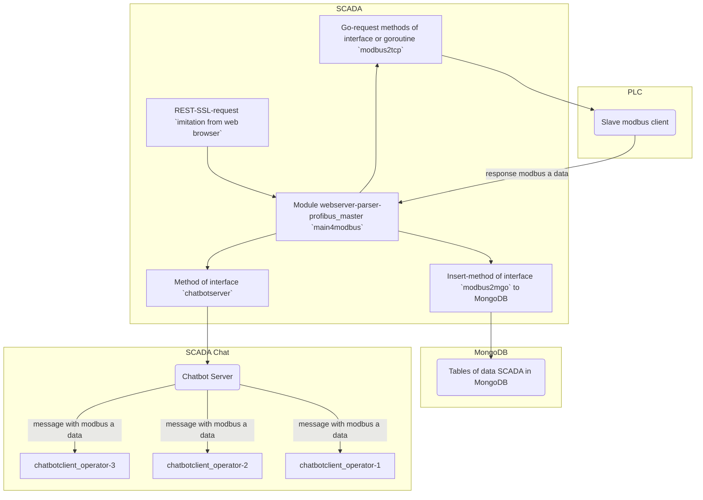

### RU

Демо код обмена данными между master-устройством и slave-устройством по `Modbus TCP (RTU)`.  
Основной модуль-вебсервер `main4modbus` содержит демонстрационный код для парсинга `https`-запросов от панели управления, реализует функции ведущего устройства, вызов методов обмена данными по протоколу `Modbus` с ведомым устройством по `TCP` или `RTU` [Diagslave](https://www.modbusdriver.com/diagslave.html)       
Записывает полученные данные от slave-устройства в `MongoDB`.  
Чат-бот `chatbotserver` отправляет полученные по `modbus` tls-данные, чат-клиентам scada.  

***Схема обмена данными (scheme exchange of data):***

 			
Для проверки, запустить модуль `main4sensors` и чат-модуль `chatbotserver`, из строки браузера создать запрос:

	https://localhost:8443/modbus_tcp:ReadCoils:16

или

	https://localhost:8443/modbus_rtu:ReadCoils:16

### EN

Demo code of data exchange between the master device and the slave device via `Modbus TCP (RTU)`.  
The main webserver module `main4modbus` contains a demo code for parsing `https`-requests from the control panel, implements the functions of a master device, calls methods for communicating via the `Modbus` protocol with a slave device via `TCP` or `RTU`.  
Writes received data from the slave to `MongoDB`.  
Chatbot `chatbotserver` sends tls-data received via `modbus` to scada chat clients.  

To check, run the `main4sensors` module and `chatbotserver` chat-module, create a request from the browser line:

	https://localhost:8443/modbus_tcp:ReadCoils:16

or

	https://localhost:8443/modbus_rtu:ReadCoils:16

